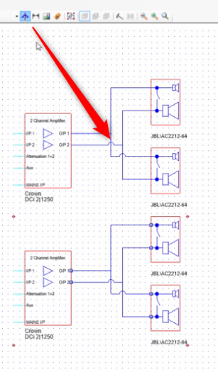
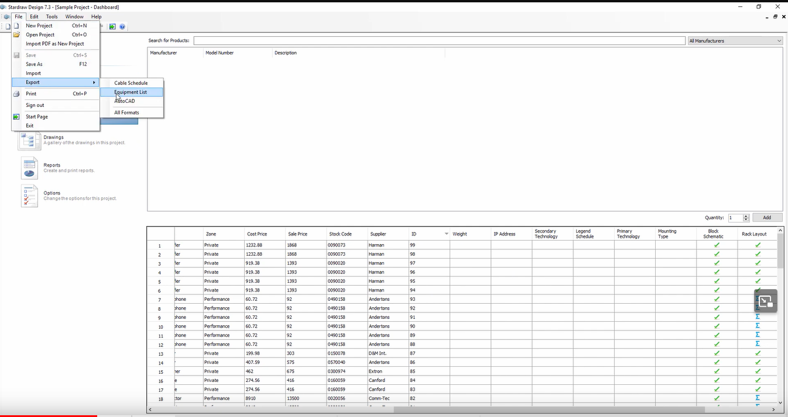

# Formation Stardraw

## Les connexions
Faire un connexion

Clic et drag = chemin auto en 3 segments
clic puis clic puis clic = chemin manuel

control + maj + c = raccourci cable
echap = shortcut flèche

Pour ajouter un point add node avec la flèche et clic droit

Afficher les ponts

4

Nom du cable

ou

incrémentation du N° si le premier cable se nomme 001.
l'incrémentation se fait par click.

Inversion de la connexion

## produit
Ajouter un produit

baie et accessoires

