# Formation Stardraw

## Les connexions
### Faire un connexion

Clic et drag = chemin auto en 3 segments
clic puis clic puis clic = chemin manuel

control + maj + c = raccourci cable
echap = shortcut flèche

Pour ajouter un point add node avec la flèche et clic droit

Afficher les ponts

4

Nom du cable

ou

incrémentation du N° si le premier cable se nomme 001.
l'incrémentation se fait par click.

Inversion de la connexion

### feathers

Utilisation des feathers pour faire un cable entre 2 produits, en utilisant le même ID
Elles sont dans les symboles stardraw online

fin connexion
====
## Liste de produits
### Ajouter un produit dans votre liste

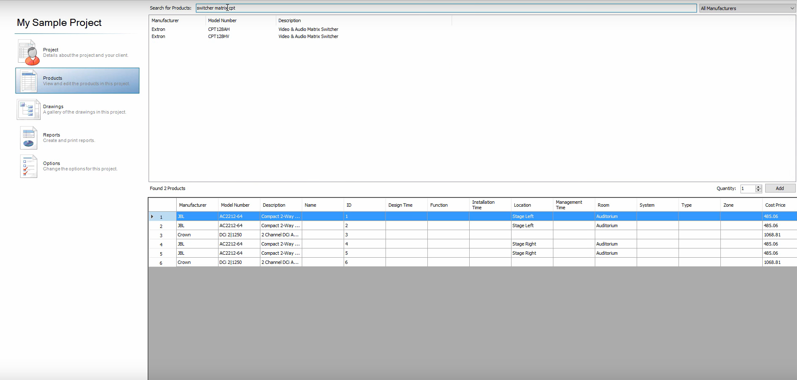

### baie et accessoires

Changer la vue et ajouter l'épaisseur des prises

Gestion des données produits pour votre schéma

Export des listes des appareils de votre schéma

Ajouter des colonnes ou des adresses IP dans excel par exemple

puis importer

Ajouter des produits manuellement dans excel

## bibliothèque de produits
### création
Créer un nouvel appareil
* 1ère solution
Faire un nouveau document, dessiner la forme

les panneaux sont dans les produits

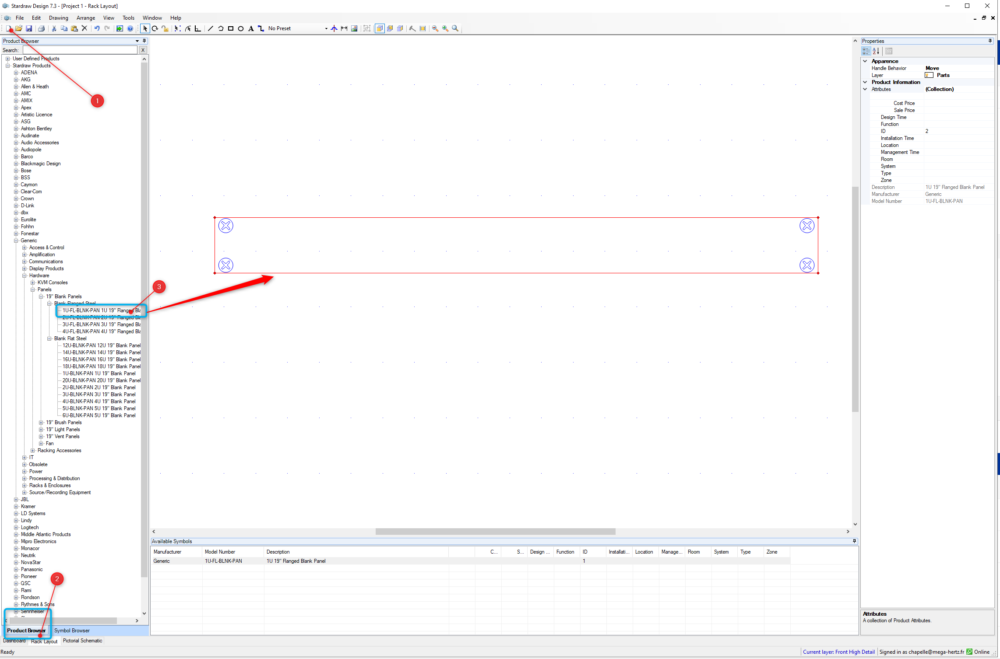

Les prises sont dans les symboles

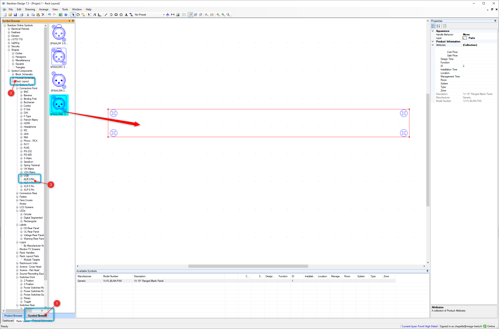

La taille du texte est en pouces, attention à la virgule et non un point

sélectionnez et arranger

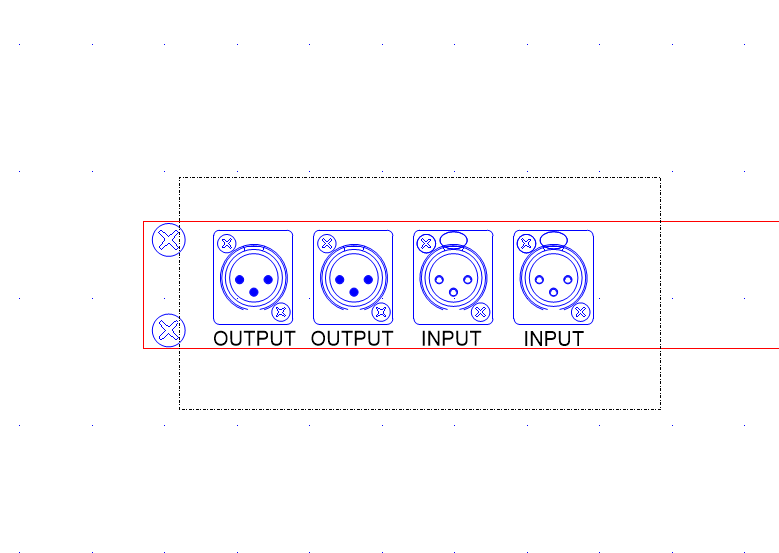

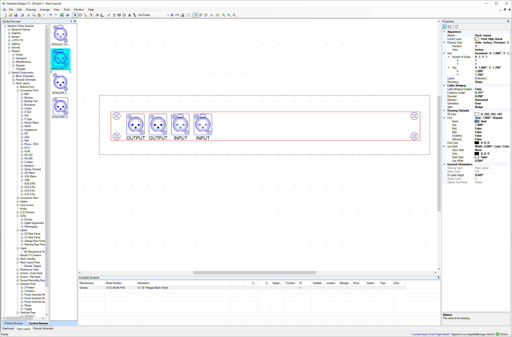

Tout sélectionner et créer la forme

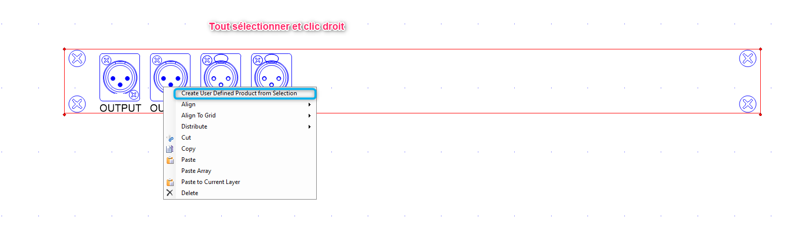

éditer le nouveau produit

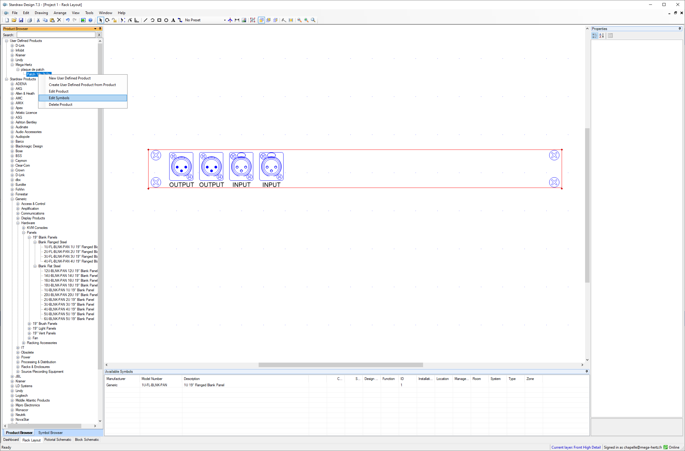

ou créer un nouveau produit directement

Nombre d'entrées

Le nom des I/O

Prendre des élements existants pour créer le pictoral design

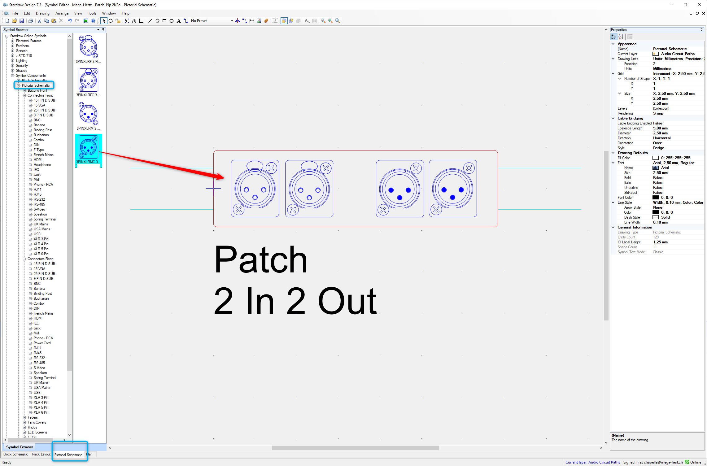

Faire le bloc design

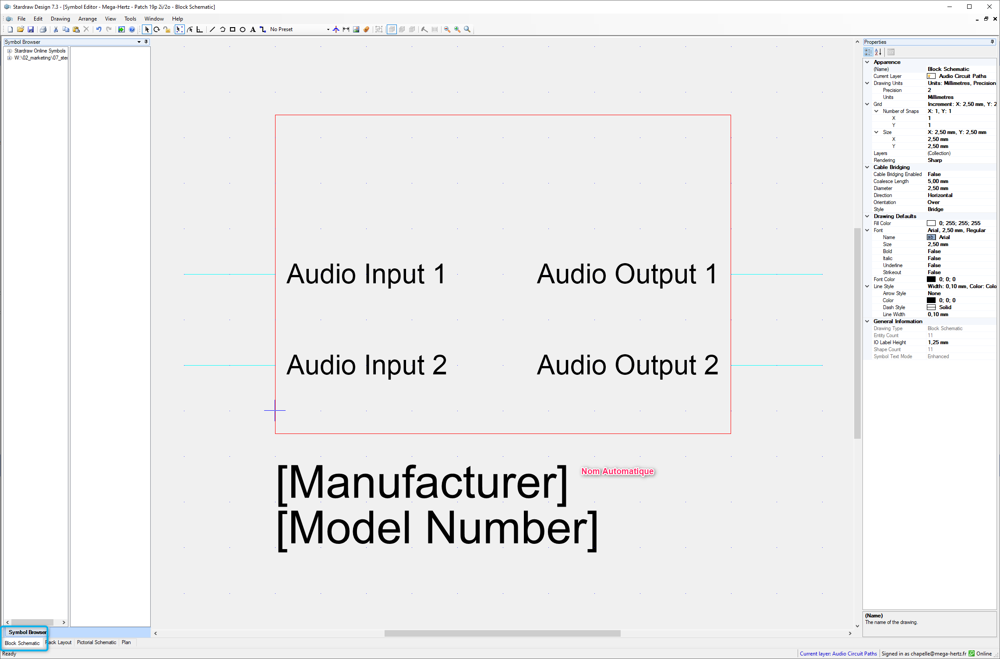

problème avec le rack design non positionné

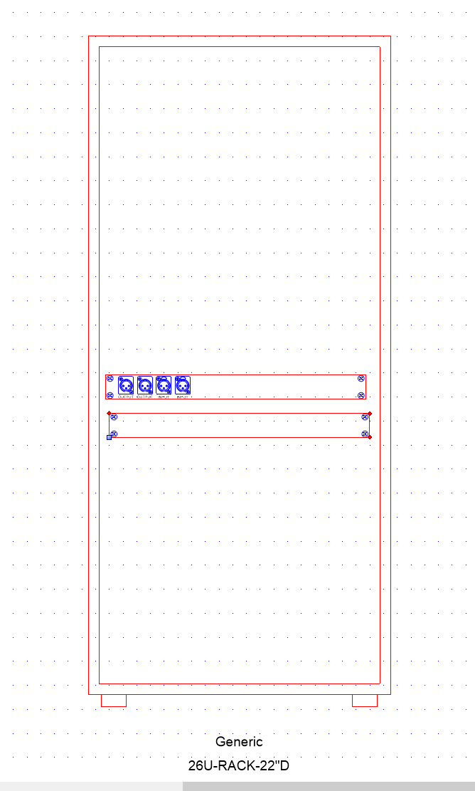

bien mettre sur la croix

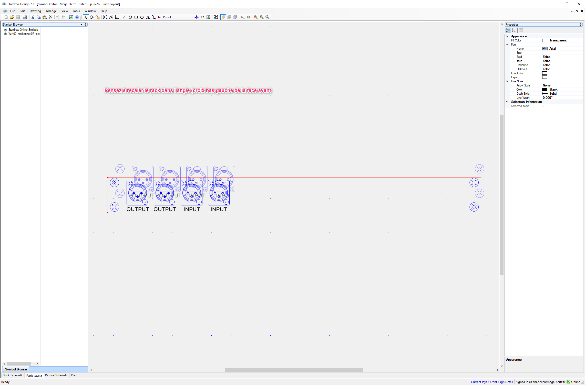

Face arrière

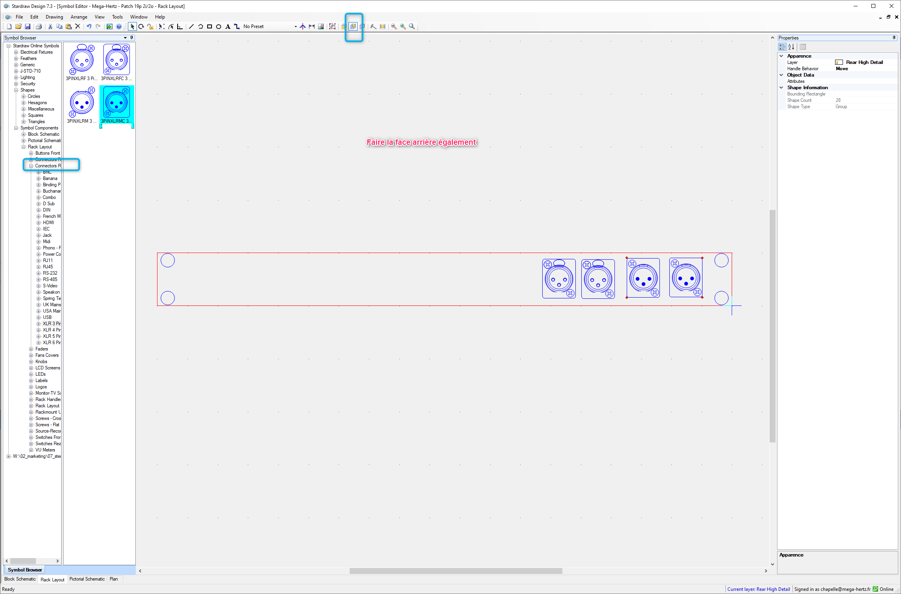

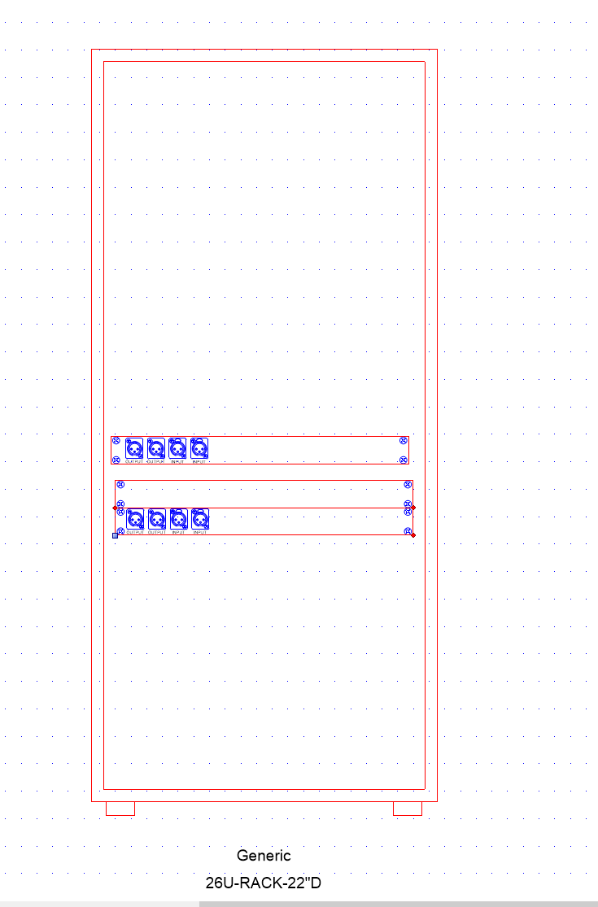

Copier en array une prise

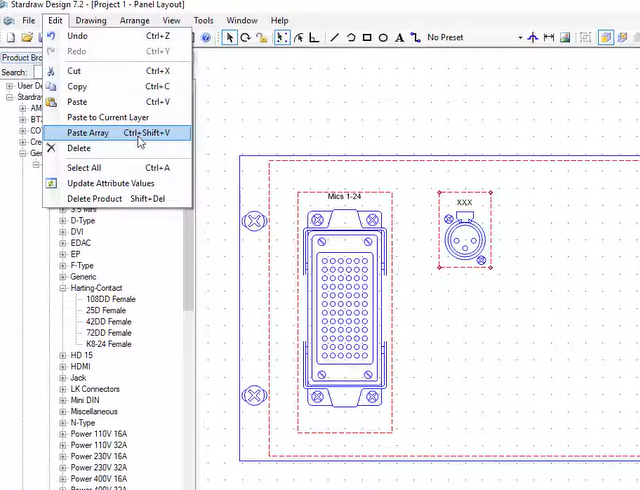

définition de la grille pour aller au demi pas

#### cas dans les visuels de rack
Créer un rack layout à partir d'un panel (option hors platinum)

Sélectionner votre layout, copier,

coller dans le rack, grouper les prises, et aligner avec le cadre

Pensez à faire la face arrière

### modification

Modifier une forme, en prenant une forme existante

puis en la modifiant

Changement de coté de la connextion

Fin bibliothèque de produits
======
## Symboles
### creation

Ajouter des symboles à partir d'un plan existant

Copier la forme, et la coller dans un nouveau document

l'exporter dans le dossier personnel des symboles (en autocad)

Fin création symboles
======

## votre document

Afficher un cadre et nomenclature
Pour la modifier, il suffit d'ouvrir le document S07 dans stardraw et le modifier

Utilisation des symboles sur les plans

Mesure

Ajouter un dossier personnel de symboles

Mise à l'echelle d'un plan

Ajouter une mesure, faire le calcul du pourcentage d'echelle à appliquer

Appliquer le pourcentage

Vérifier

